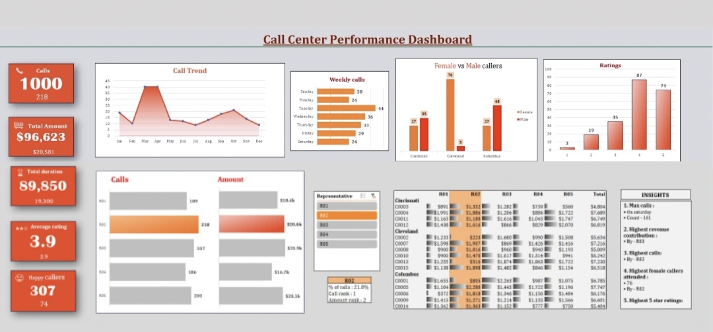

# 📊 Excel Dashboards Portfolio

> A collection of Excel dashboards built from scratch while learning 
Data Analytics as a 1st year CSE student.

---

## 🗂️ Dashboard 1 — Call Center Performance Dashboard

### 📌 About This Project
An interactive Excel dashboard analyzing Call Center performance data
including call volumes, revenue, agent ratings and customer demographics.

### 🎯 What This Dashboard Shows
- Total Calls, Revenue, Call Duration and Average Rating (KPI Cards)
- Monthly Call Trend (Line Chart)
- Weekly Call Distribution (Bar Chart)
- Female vs Male Caller Comparison by City (Clustered Bar Chart)
- Customer Rating Distribution (Bar Chart)
- Agent wise Calls and Revenue Breakdown
- City wise Revenue Matrix (Cincinnati, Cleveland, Columbus)
- Key Insights Panel (auto generated observations)

### 🛠️ Tools and Features Used
- Microsoft Excel
- Pivot Tables
- Pivot Charts
- Conditional Formatting
- KPI Card Design
- Data Filtering and Slicers
- Chart Formatting and Dashboard Layout

### 📈 Key Insights Found
1. Maximum calls received on Saturday (161 calls)
2. Highest revenue contributed by Agent R03
3. Highest total calls by Agent R02
4. Cleveland had the highest female caller ratio

### 📷 Dashboard Preview

---

## 🙋‍♀️ About Me
- 🎓 B.Tech CSE — 1st Year
- 📊 Currently learning Excel + Data Analytics
- 💻 Also practising DSA on HackerRank
- 🚀 Building skills to freelance on Fiverr
- 🐦 Twitter: @DebugDiaries02

---

## 📅 More Dashboards Coming Soon...
---

## 📬 Connect With Me
- LinkedIn: https://www.linkedin.com/in/shevya-goyal-b02221372
  
---

⭐ If you found this helpful, consider starring this repository!
